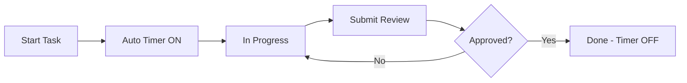
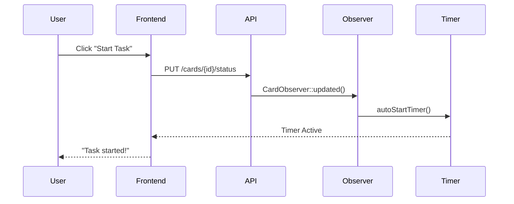

# 🕐 SISTEM AUTO-TIMER TERINTEGRASI

> **Sistem time tracking otomatis** yang mencatat waktu pengerjaan task secara real-time dari start hingga deadline dengan Observer Pattern.

## 🚀 QUICK START

<details>
<summary><strong>📋 Workflow Overview</strong></summary>



**Status Flow:** `todo` → `in_progress` → `review` → `done` (or back to `in_progress`)
</details>

## ⚡ CORE FEATURES

<details>
<summary><strong>🎯 Auto-Timer System</strong></summary>

| Trigger | Action | Result |
|---------|---------|---------|
| **Start Task** | Status: `todo` → `in_progress` | ✅ Timer auto-start |
| **Submit Review** | Status: `in_progress` → `review` | ⏸️ Timer pause |
| **Reject** | Status: `review` → `in_progress` | ▶️ Timer resume |
| **Approve** | Status: `review` → `done` | ⏹️ Timer stop |

</details>

<details>
<summary><strong>📊 Real-time Tracking</strong></summary>

- 🕒 **Live Duration**: Display waktu berjalan vs estimasi
- 📈 **Progress Bar**: Visual persentase completion
- 🔴 **Active Indicator**: "Timer running" badge
- 📅 **Deadline Monitor**: Color-coded due dates

</details>

<details>
<summary><strong>⚙️ Observer Integration</strong></summary>

**CardObserver** auto-detects status changes:
```php
// Trigger: Card status update
CardObserver::updated() → handleStatusChange() → autoStartTimer()
```

</details>

## 🏗️ ARCHITECTURE

<details>
<summary><strong>🗄️ Database Schema</strong></summary>

### Cards Table (Enhanced)
| Field | Type | Purpose |
|-------|------|---------|
| `status` | enum | Workflow state |
| `started_at` | timestamp | Auto-set on start |
| `completed_at` | timestamp | Auto-set on done |
| `estimated_hours` | decimal | Time estimate |
| `actual_hours` | decimal | Real tracked time |
| `is_timer_active` | boolean | Live timer status |

### TimeLog Table
| Field | Type | Purpose |
|-------|------|---------|
| `auto_timer_type` | enum | `status_change` \| `manual` |
| `is_active` | boolean | Current session |
| `duration_minutes` | int | Session duration |

</details>

<details>
<summary><strong>🔧 Backend Components</strong></summary>

### Core Methods
```php
Card::handleStatusChange()     // Auto-timer logic
Card::autoStartTimer()         // Start session
CardObserver::updated()        // Status monitor
TimeLog::createAutoSession()   // Track time
```

### API Endpoints
- `GET /api/cards` - Paginated card list
- `PUT /api/cards/{id}/status` - Update status
- `GET /api/timer/active` - Current timer

</details>

<details>
<summary><strong>🖥️ Frontend Functions</strong></summary>

### Active Functions
```javascript
loadCards(useCache=true)       // Cached card loading
startCard(cardId)              // Status update
loadActiveTimer()              // Timer display
updateCardStatus()             // API integration
```

### Removed (Unused)
```javascript
// ❌ Deprecated functions removed:
// - getCardTimeInfo() → Now handled in backend
// - displayCards() → Merged into loadCards()
// - loadDeadlineCards() → Integrated with loadCards()
// - showSuccessMessage() → Using toast library
```

</details>

## 🔄 EXECUTION FLOW

<details>
<summary><strong>🎯 Start Task Process</strong></summary>



**Key Actions:**
1. Status: `todo` → `in_progress`
2. Auto-set `started_at` timestamp
3. Create TimeLog session
4. UI updates with live timer

</details>

<details>
<summary><strong>📝 Review Workflow</strong></summary>

| Action | Status Change | Timer Behavior |
|--------|---------------|----------------|
| **Submit** | `in_progress` → `review` | ⏸️ Pause (continues in background) |
| **Approve** | `review` → `done` | ⏹️ Stop & save |
| **Reject** | `review` → `in_progress` | ▶️ Resume automatically |

</details>

## 🎨 UI COMPONENTS

<details>
<summary><strong>📱 Card Display (Optimized)</strong></summary>

```html
<!-- Modern Card Layout -->
<div class="card task-card" data-status="in_progress">
  <div class="card-header d-flex justify-content-between">
    <span class="badge bg-primary">In Progress</span>
    <span class="timer-badge bg-success">⏺ LIVE</span>
  </div>
  
  <div class="card-body">
    <h6 class="card-title">Task Title</h6>
    <p class="card-text text-truncate">Description...</p>
    
    <!-- Progress Section -->
    <div class="time-progress">
      <div class="progress mb-2">
        <div class="progress-bar bg-success" style="width: 50%"></div>
      </div>
      <small class="text-muted">2.5h / 5h estimated</small>
    </div>
  </div>
</div>
```

**Features:**
- ✅ Real-time progress bars
- ✅ Live timer indicators  
- ✅ Responsive design
- ✅ Skeleton loading states

</details>

<details>
<summary><strong>⏰ Timer Widget</strong></summary>

```html
<div class="active-timer-widget">
  <span class="badge bg-success">AUTO</span>
  <span class="timer-text">2h 30m</span>
  <small class="task-name">Working on: Task Title</small>
</div>
```

**Updates every 5 seconds via cache system**

</details>

## ✅ SYSTEM STATUS

<details>
<summary><strong>🔧 Production Checklist</strong></summary>

| Component | Status | Notes |
|-----------|--------|-------|
| **Database** | ✅ Ready | Migrations applied |
| **Models** | ✅ Ready | Auto-timer logic |
| **Observer** | ✅ Active | Status monitoring |
| **API** | ✅ Optimized | Pagination + caching |
| **Frontend** | ✅ Enhanced | Cache + debounce |
| **Timer System** | ✅ Live | Real-time tracking |

</details>

## 🚀 QUICK USAGE

<details>
<summary><strong>👨‍💻 Developer Workflow</strong></summary>

1. **Login** → Access developer panel
2. **View Tasks** → See assigned cards with deadlines
3. **Start Work** → Click "Start Task" (auto-timer begins)
4. **Track Progress** → Real-time duration display
5. **Submit** → "Submit for Review" (timer pauses)
6. **Handle Feedback** → Auto-resume on rejection

</details>

<details>
<summary><strong>📊 Data Captured</strong></summary>

- ⏰ **Timestamps**: `started_at`, `completed_at`
- 📈 **Duration**: Total `actual_hours` worked
- 📝 **Sessions**: Detailed time logs per work session
- 🔄 **Workflow**: Status changes and rejections
- 📊 **Analytics**: Progress vs estimation metrics

</details>

---

<div align="center">

**🎯 STATUS: FULLY OPERATIONAL**

*Auto-timer system ready for production with optimized performance*

</div>
